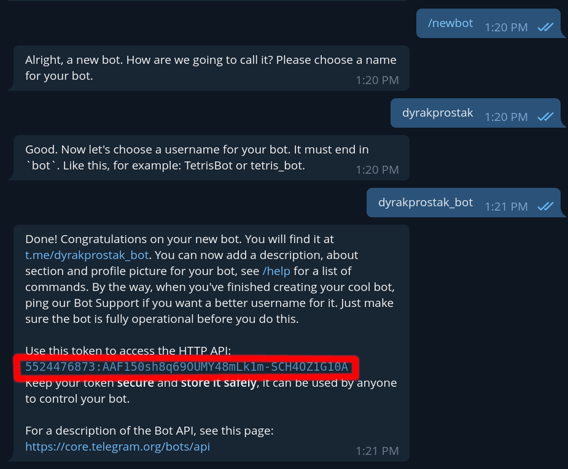
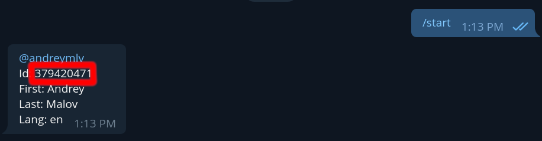

# mailing-telegram-bot

## Описание

Телеграмм-бот, который рассылает сообщение всем зарегистрированным пользователям.

## Используемые библиотеки и зависимости

- Компилятор - `g++` или `clang++`
- Система сборки - `Make`
- Telegram Bot API - [tgbot-cpp](https://github.com/reo7sp/tgbot-cpp) (MIT LICENSE)
- Fast C++ logging library - [spdlog](https://github.com/gabime/spdlog) (MIT LICENSE)

## Инструкция для чайников

1. Создать бота у [Bot Father](https://t.me/BotFather):
   1. Запустите бота (Bot Father)
   2. Напишите в чате с Bot Father команду `/newbot`
   3. Напишите имя своего бота (название должно быть на английском и конец названия должен содержать `bot`) 
   4. Если всё получилось, то Bot Father должен предоставить вам токен (на картинке выделено красным) для того, чтобы управлять ботом
2. Получить ID админа, для того, чтобы рассылать сообщение централизованно:
   1. Написать этому [боту](https://t.me/userinfobot) 
   2. В поле ID - ваш ID

## Как собрать и запустить проект

Клонировать проект:

```console
git clone https://github.com/tstuteam/mailing-telegram-bot.git
```

Установить зависимости.

Запустить терминал и написать следующее:

```console
make all
touch users.db
TELEGRAM_BOT_TOKEN=<токен бота> TELEGRAM_BOT_ADMIN_ID=<user id админа> ./bot users.db
```

## Алгоритм работы

1. На команду `/start`
   1. Бот начинает беседу с пользователем
2. На команду `/register`
   1. Регистрировать пользователя в системе
   2. Если пользователь это админ, тогда игнорировать
3. На команду `/unregister`
   1. Удалить зарегистрированного пользователя из системы
   2. Если пользователь это админ, тогда игнорировать
   3. Если пользователь не был зарегистрирован, тогда игнорировать
4. На любое сообщение от пользователя бот повторяет сообщение пользователя
5. На любое сообщение от админа бот рассылает всем зарегистрированным пользователям это сообщение
6. На любые картинки от пользователя бот сохраняет картинки

## Как бот на C++ общается с API Telegram

Чтобы общаться с сервером Telegram бот-клиент должен посылать http запросы по адресу `https://api.telegram.org`.
Библиотека `tgbot-cpp` облегчает работу программисту, так как она может парсить, хранить ответы сервера Telegram в удобном виде.

Если более подробно, то при каждом обращении к API Telegram бот формирует запрос с необходимым действием.
Например, чтобы отправить сообщение пользователю бот построит примерно такой запрос: `https://api.telegram.org/bot123456:ABC-DEF1234ghIkl-zyx57W2v1u123ew11/sendMessage?chat_id=123124&text=Hello_World`.
При успешном выполнении запроса Telegram API отправит в ответ JSON, в котором будет сформирован объект `Message`.

Репозиторий `tgbot-cpp` имеет много [примеров кода](https://github.com/reo7sp/tgbot-cpp/tree/master/samples) использования библиотеки, что облегчает знакомство с библиотекой.
